# POKÉMON GO DASHBOARD

## Índice

* [¡Regresa al mundo de los Pokémon!](#Regresa-al-mundo-de-los-Pokémon)
* [Pokémon Go Dashboard](#Pokémon-Go-Dashboard)
* [Definición del producto](#Definición-del-producto)
* [Entrevistas](#[Entrevistas)
* [Historias de usuario](#Historias-de-usuario)
* [Prototipo de baja fidelidad o Sketch](#Prototipo-de-baja-fidelidad-o-Sketch)
* [Prototipo de alta fidelidad o Diseño de la interfaz de usuario](#Prototipo-de-alta-fidelidad-o-Diseño-de-la-interfaz-de-usuario)
* [Test de usabilidad](#Test-de-usabilidad)

***

## ¡Regresa al mundo de los Pokémon!

Pokémon Go ha causado sensación desde el día de su lanzamiento, atrayendo a jóvenes y adultos a este nuevo mundo virtual por medio de la realidad aumentada.
De acuerdo con el concepto original, los entrenadores buscan capturar Pokémon hasta completar una colección. El otro objetivo es adiestrarlos para que ganen batallas frente a otras criaturas.
El juego ha conseguido superar los 65 millones de usuarios al día y ha generado aglomeraciones en las ciudades. Pero, ¿por qué este juego ha causado tanto impacto en los usuarios?
La idea de llegar a convertirse en un maestro Pokémon es un feeling con el que ha crecido toda una generación, Pokémon Go te permite vivir la experiencia de un verdadero entrenador pokémon.

## Pokémon Go Dashboard

Pokémon Go Dashboard es una herramienta de ayuda para todos los usuarios de Pokémon Go, ya que te permite hacer, desde una búsqueda específica de un Pokémon, filtrarlos por tipo y tipo de huevo. Hacer un cálculo real de caramelos que le falta a tu Pokémon para llegar a la siguiente evolución, también se podré ver tablas estadísticas según el promedio de debilidades por tipo de Pokémon.

link a [Pokémon-Go-Dashboard](https://carocampossalazar.github.io/lim-2018-11-bc-core-am-data-lovers/src/)

## Definición del producto

1. ¿Quiénes son los principales usuarios de producto?

    Jugadores de Pokémon Go.

2. ¿Cuáles son los objetivos de los usuarios?

    Obtener información específica sobre los pokémon que se encuentran en el juego.

3. ¿Cuáles son los datos más relevantes que quieren ver en la interfaz y por qué?

    - Tipos de pokémon.
    - Que pokémon se puede obtener según el tipo de huevo.
    - Cantidad de caramelos que se necesita para evolucionar un pokémon.
    - Poder ordenar los pokémon según número de Pokédex.
    - Poder ordenar los pokémon según orden alfabético de A-Z y Z-A.

4. ¿Cuándo utilizan o utilizarían el producto?

    Cuando quieran obtener información de un pokémon en específico.

5. ¿Cómo crees que el producto resuelve el problema que tiene tu usuario?

El presente proyecto soluciona la necesidad del usuario de acceder fácilmente a informacion específica sobre los pokémon que se encuentran en el juego Pokémon Go.

## Entrevistas

Para la elaboración de las entrevistas, escogimos a usuarios habituales de Pokémon Go para que nos respondan las siguientes preguntas:

1. ¿Cuál es su objetivo con el juego?

    - Atrapar todos los pokémon.
    - Capturar los 150 pokemones originales.

2. ¿Que datos son los más importantes en el juego?

    - La fecha de inicio del juego, la cantidad de experiencia que tienes, la cantidad de Pokémon es que tienes. 
    - El poder del Pokémon que capturas, cuantos Pokémon tienes.
    - En que zonas hay mas posibilidad de encontrar ciertos Pokémon.

3. ¿Qué datos les gustaría comparar o filtrar?

    - Ver que ataques son mas efectivos contra otros Pokémon.
    - Cantidad de experiencia que ganas por día, cantidad de Pokémon (nuevos, únicos, todos) que atrapas por día y poder definir rangos de fecha para los reportes (tipo analytics)
    - Me gustaría poder poner mis Pokémon destacados primero, para elegir fácil cuando peleas, poder filtrar por tipo (eléctrico, de agua, etc), y poder tener duelos fuera de los gimnasios.

## Historias de usuario

### Historia 1

COMO: Jugador de Pokémon Go.

QUIERO: Filtrar los pokémon según su tipo.

PARA: Saber que pokémon hay en cada tipo.

CRITERIOS DE ACEPTACIÓN

- La página debe permitir filtrar según el tipo de pokémon.
- La página debe mostrar a los pokémon según el tipo al que pertenezcan.
- El usuario debe poder seleccionar el tipo de pokémon que desea ver.
- Debe pasar Test unitario.
- Debe ser responsive.

### Historia 2

COMO: Jugador de Pokémon Go.

QUIERO: Filtrar los pokémon según el tipo de huevo.

PARA: Poder saber que pokémon puedo obtener según el tipo de huevo.

CRITERIOS DE ACEPTACIÓN

- La página debe permitir filtrar según el tipo de huevo.
- La página debe mostrar a los pokémon según el tipo de huevo al que pertenezcan.
- El usuario debe poder seleccionar el tipo de huevo que desea ver.
- Debe pasar Test unitario.
- Debe ser responsive.

### Historia 3

COMO: Jugador de Pokémon Go.

QUIERO: Ordenar a los pokémon según su número de Pokédex

PARA: Poder ubicarlo facilmente.

CRITERIOS DE ACEPTACIÓN

- La página debe permitir ordenar a los pokémon según el número de Pokédex.
- La página debe mostrar a los pokémon ordenados según el número de Pokédex.
- El usuario debe poder seleccionar la opción Ordenar según el número de Pokédex.
- Debe pasar Test unitario.
- Debe ser responsive.

### Historia 4

COMO: Jugador de Pokémon Go.

QUIERO: Ordenar a los pokémon según el orden alfabético de la A-Z.

PARA: Poder ubicarlo facilmente.

CRITERIOS DE ACEPTACIÓN

- La página debe permitir ordenar a los pokémon según el orden alfabético de la A-Z.
- La página debe mostrar a los pokémon ordenados según el orden alfabético de la A-Z.
- El usuario debe poder seleccionar la opción Ordenar a los pokémon según el orden alfabético de la A-Z.
- Debe pasar Test unitario.
- Debe ser responsive.

### Historia 5

COMO: Jugador de Pokémon Go.

QUIERO: Ordenar a los pokémon según el orden alfabético de la Z-A.

PARA: Poder ubicarlo facilmente.

CRITERIOS DE ACEPTACIÓN

- La página debe permitir ordenar a los pokémon según el orden alfabético de la Z-A.
- La página debe mostrar a los pokémon ordenados según el orden alfabético de la Z-A.
- El usuario debe poder seleccionar la opción Ordenar a los pokémon según el orden alfabético de la Z-A.
- Debe pasar Test unitario.
- Debe ser responsive.

### Historia 6

COMO: Jugador de Pokémon Go.

QUIERO: Calcular cuantos caramelos necesito para la evolución de mi pokémon.

PARA: Saber cuantos caramelos le falta para evolucionar y a que pokémon evoluciona.

CRITERIOS DE ACEPTACIÓN

- La página debe permitir ingresar el nombre del pokémon que desea evolucionar.
- La página debe permitir ingresar la cantidad de caramelos que el usuario tiene actualmente.
- La página debe permitir presionar un botón para realizar el cálculo.
- La página debe mostrar la cantidad de caramelos que le falta al pokémon para evolucionar.
- La página debe mostrar el nombre del pokémon al que va evolucionar.
- Debe pasar Test unitario.
- Debe ser responsive.

## Prototipo de baja fidelidad o Sketch

*PRIMER PROTOTIPO*: Versión móvil, tablet y escritorio

 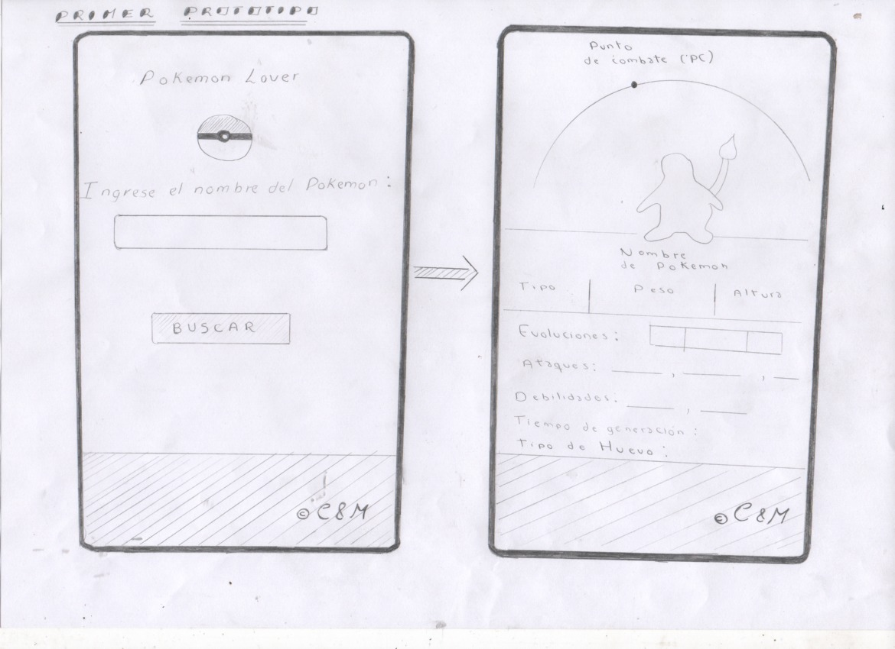

*SEGUNDO PROTOTIPO*: Versión móvil, tablet y escritorio

 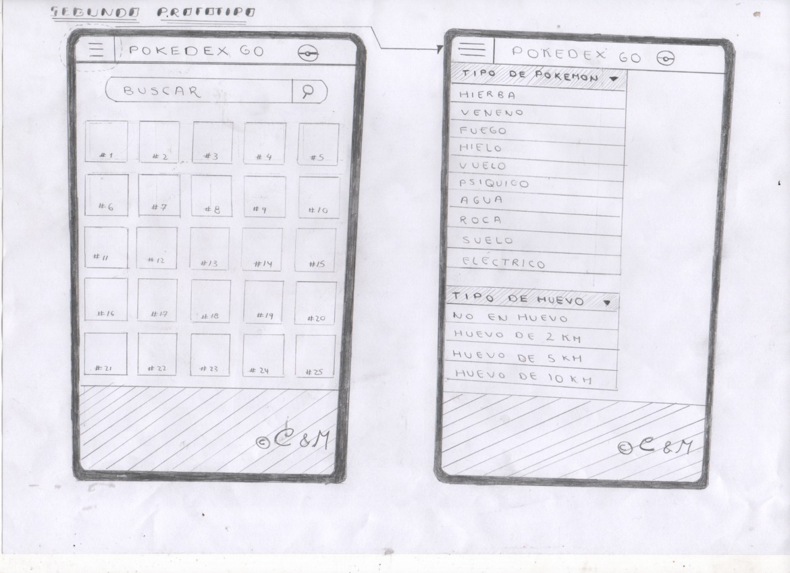
 
*TERCER PROTOTIPO*: Versión móvil(1) y Versión tablet y escritorio(2)

 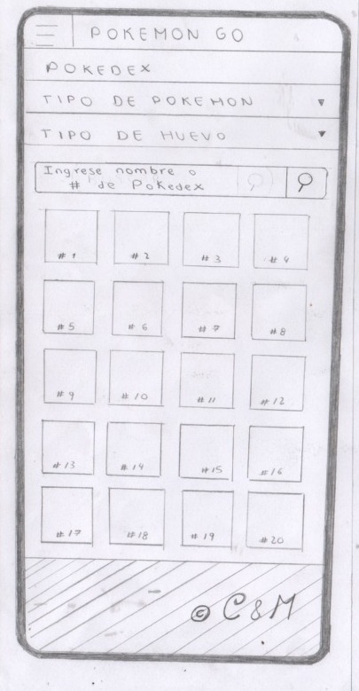

 

*CUARTO PROTOTIPO*: Versión móvil(1) y Versión tablet y escritorio(2)

 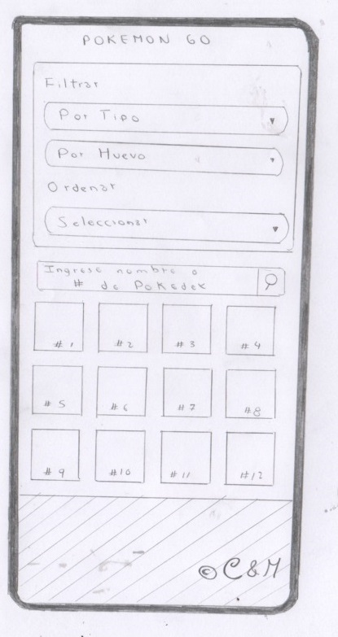

 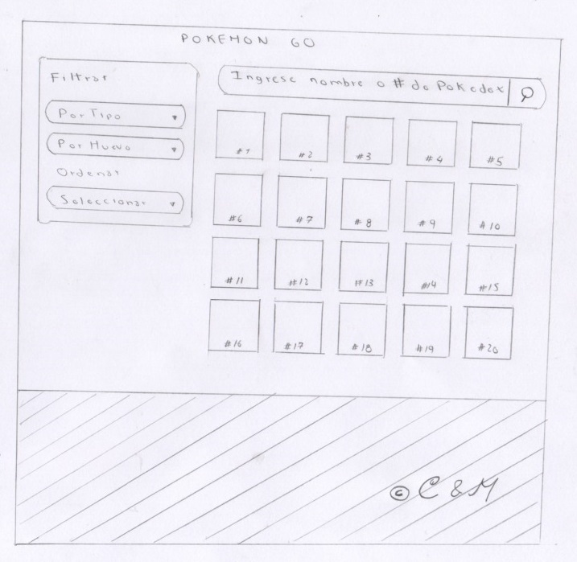

*QUINTO PROTOTIPO*: Versión móvil(1) y Versión tablet y escritorio(2)

 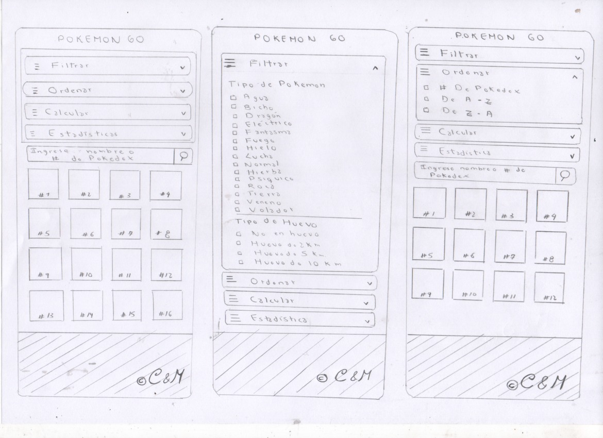

 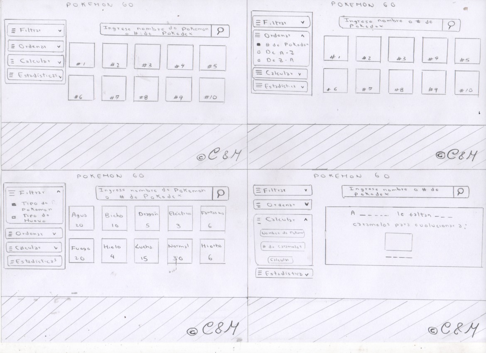

## Prototipo de alta fidelidad o Diseño de la interfaz de usuario

Link a Zeplin [Dashboard-Desktop](https://zpl.io/VkwpyJ8)
Link a Zeplin [Dashboard-Mobile](https://zpl.io/bWgXMWj)

*INICIO*

 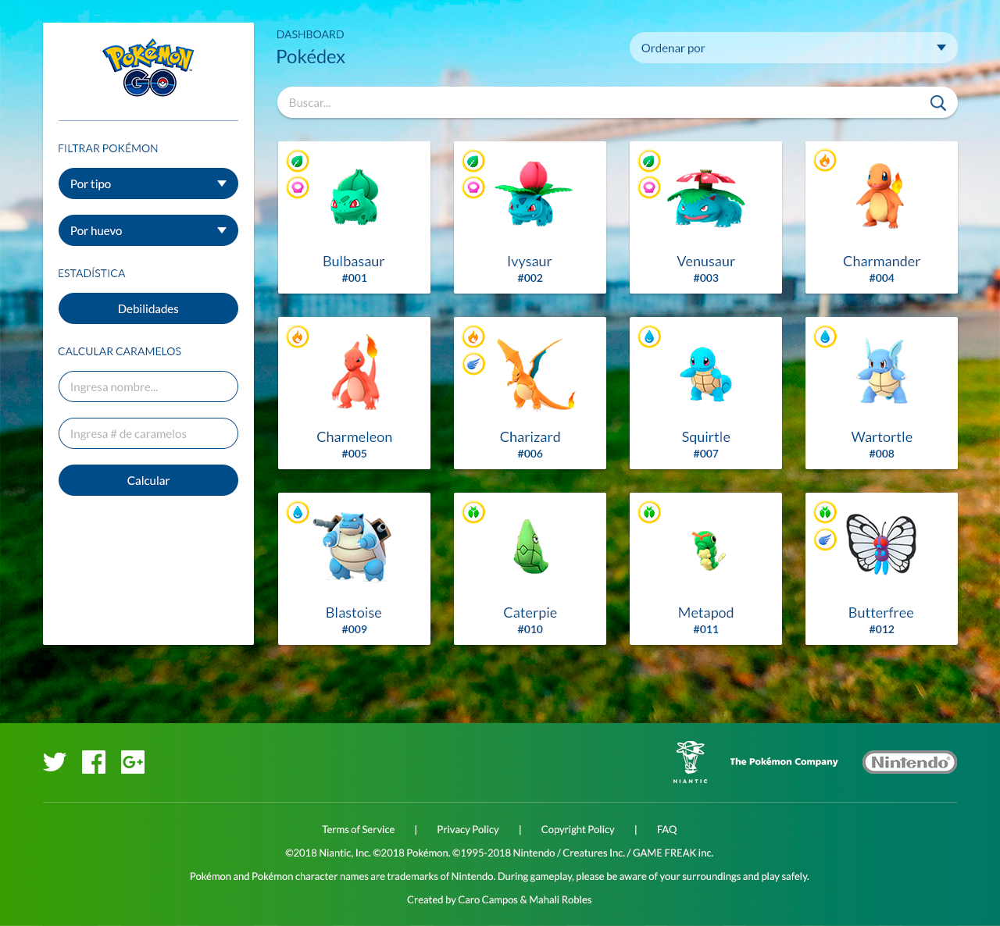

*SELECT ORDENAR*

 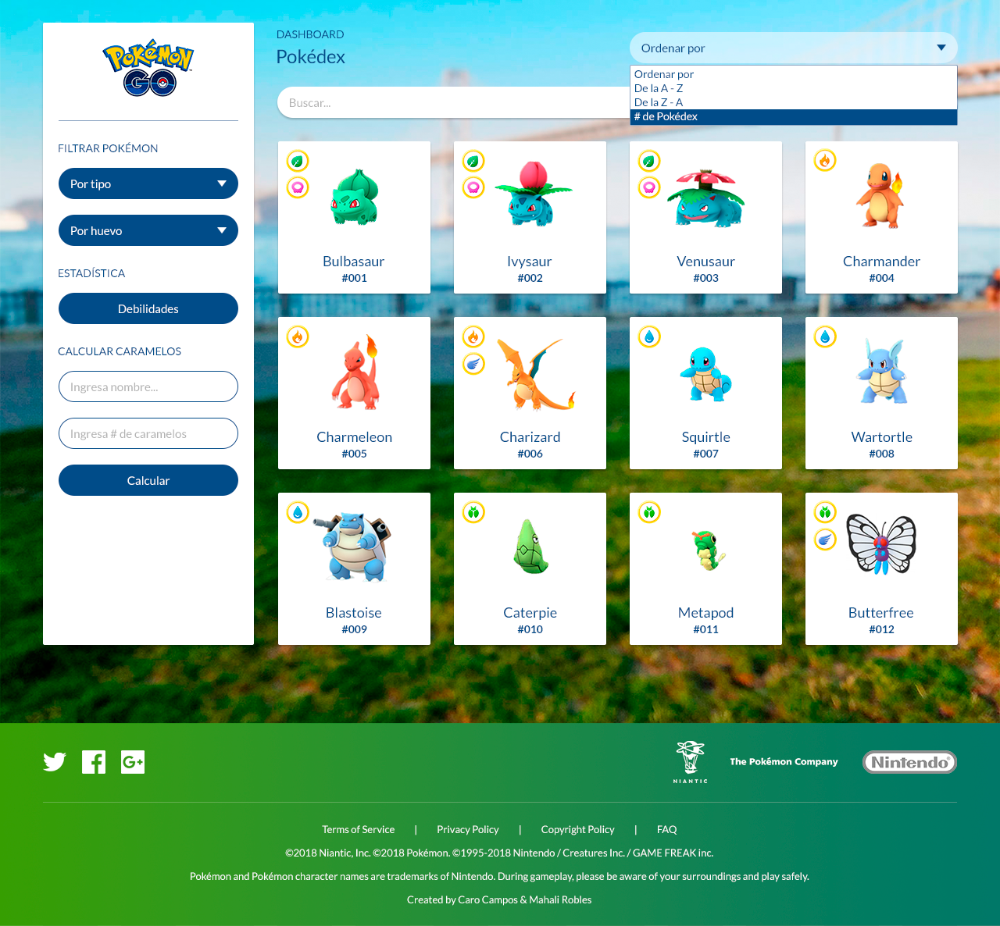

*BUSCADOR*

 

*SELECT TIPO DE POKÉMON*

 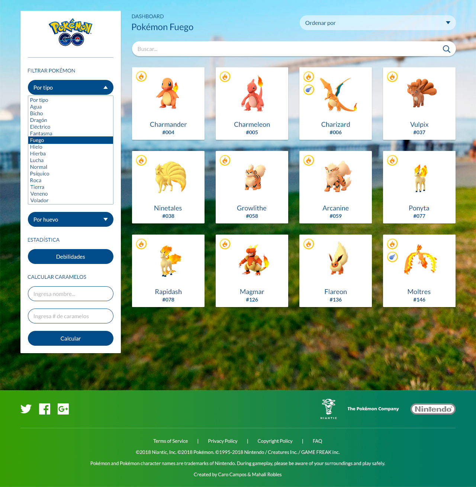

*SELECT TIPO DE HUEVO*

 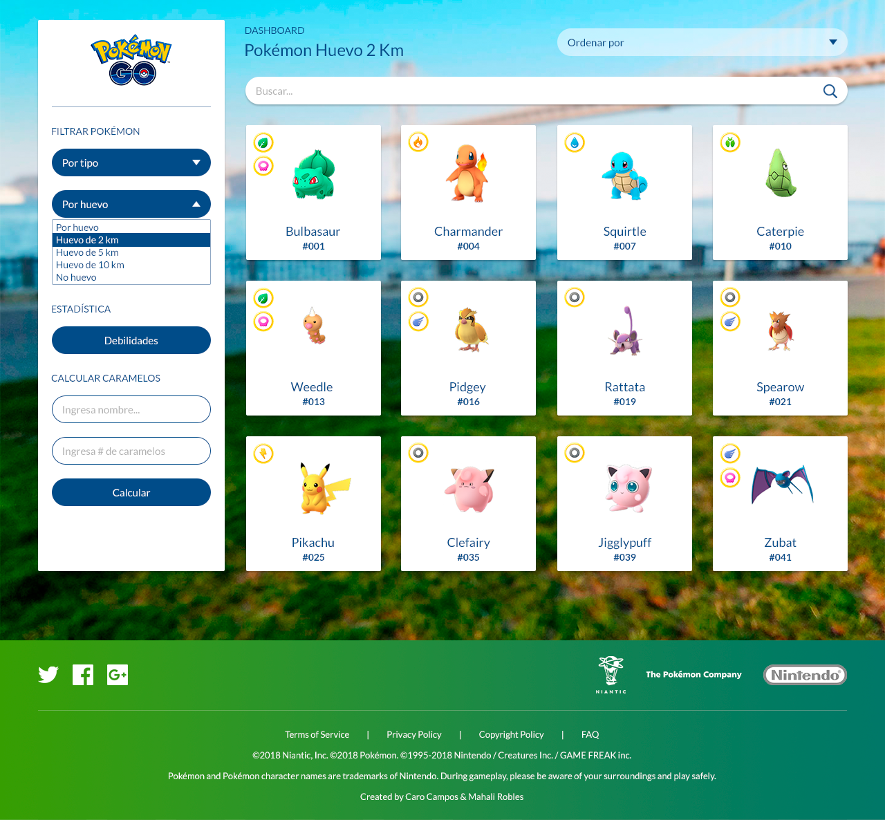

*CALCULAR CARAMELOS*

 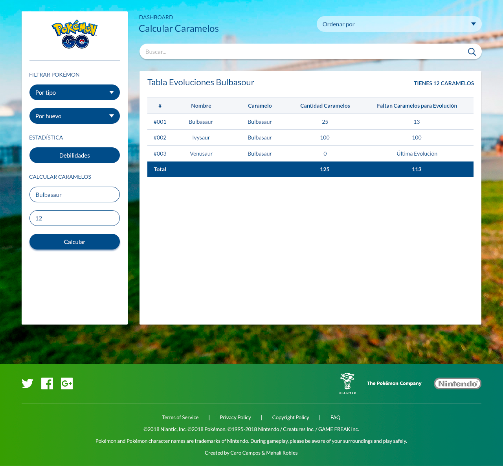

*ESTADÍSTICA DE DEBILIDADES*

 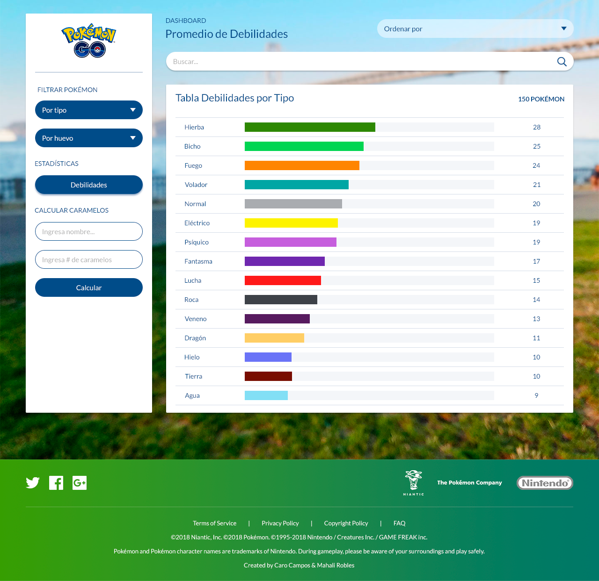

## Test de usabilidad

Testeo de primer prototipo de baja fidelidad: 

- El usuario solicitó poder ver a los pokémon segun el tipo de pokémon y tipo de huevo.
- También comentó que era importante que aparezca el número de Pokédex en la imagen.

Testeo de segundo prototipo de baja fidelidad: 

- El usuario solicitó que al buscar al pokémon aparezca el cuadro de ese pokémon.
- Que también pueda presionar ese cuadro y aparezca todo el dato informativo del pokémon como se mostró en el primer prototipo. 
- También solicitó no solo poder buscar por nombre sino también por número de Pokédex. 
- El usuario solicitó que la forma de acceder a los tipos de pokémon sea diferente para Desktop.

Testeo de tercer prototipo de baja fidelidad:

- Fue a partir de este prototipo que se comenzó a trabajar en el primer sprint
- En el testeo el usuario pidió poder ordenar a los pokémon por # de Pokédex, de la A-Z y Z-A.
- Por último poder calcular la cantidad de caramelos que le faltaban a su pokémon.

